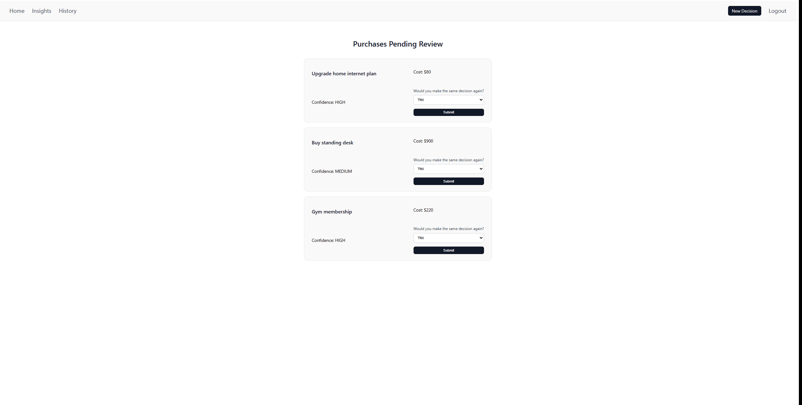
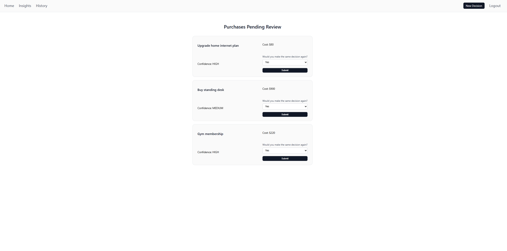
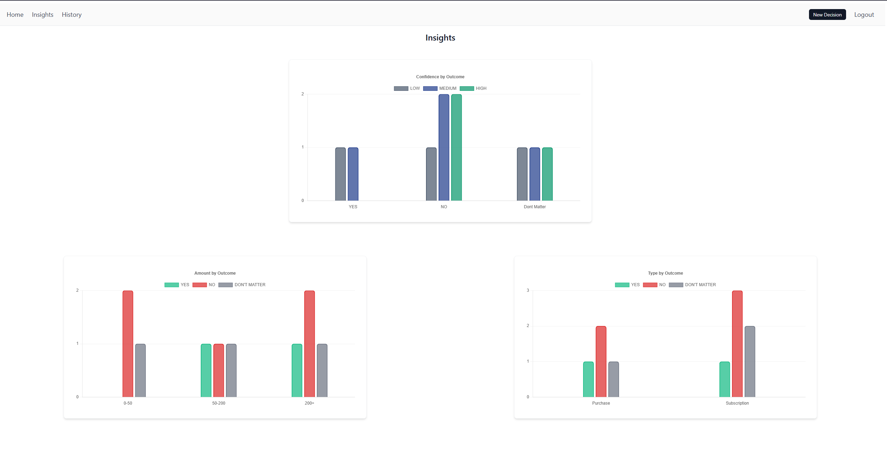
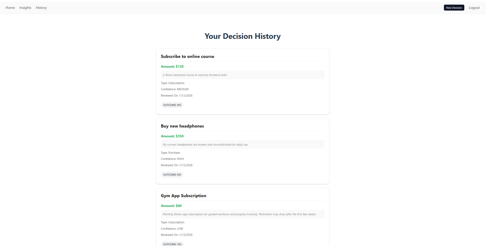

# Money Decisions Lab

Money Decisions Lab is a full-stack web application for tracking and reviewing financial decisions over time.

Instead of judging a decision immediately, users log it with a confidence level and return week later to evaluate whether they would make the same choice again. Over time, this creates clear patterns between confidence, spending, and outcomes.

---

## What you can do

* Sign up and log in using session-based authentication
* Create financial decisions (purchase or subscription)
* Assign an initial confidence level
* Review decisions after time has passed
* Mark outcomes: **Yes / No / Doesn’t Matter**
* Explore insights based on real decision data

---

## Screenshots

### Review Flow

Reviewing a pending decision and submitting the outcome.

### Pending Decisions

### Insights Dashboard

### Decision History

### Create New Decision

---

## Tech Stack

**Frontend**

* React (Vite)
* React Router
* Chart.js
* CSS Modules

**Backend**

* Node.js
* Express.js
* Prisma
* PostgreSQL
* express-session

---

